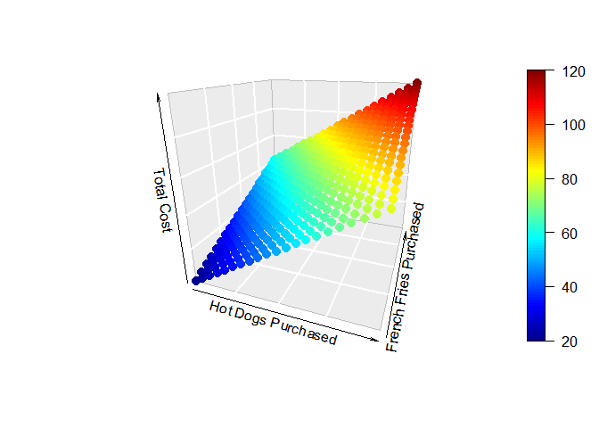

🦄 Matemática esencial para Machine Learning en R
===============================
Apuntes de Algebra Lineal y Cálculo en R. Archivos .R.

Mas apuntes de Data Science y Machine Learning:

https://zpio.github.io/datascience/

### Contenido:
- [1 Escalares, Vectores, y Matrices](#escalares-vectores-matrices)
- [2 Operaciones con Vectores](#Operaciones-con-Vectores)
- [3 Operaciones con Matrices: Suma, Resta y Multiplicación](#Operaciones-con-matrices)
- [4 Operaciones con matrices: Matrices transpuestas, inversas e identidad](#Operaciones-con-matrices2)
- [5 Introducción a Regresión Lineal](#intro-regresion-lineal)
- [6 Representación Matricial de la Regresión Lineal](#matrices-regresion-lineal)
- [7 Funciones y rectas tangentes](#funciones-rectas-secantes-tangentes)
- [8 Derivada de una Función](#derivada-funcion)
- [9 Optimizacion mediante Derivadas - Funciones de una variable](#optimizacion-derivadas-una-variable)
- [10 Optimizacion mediante Derivadas - Funciones de dos variables](#optimizacion-derivadas-dos-variable)
- [11 Vectores Ortogonales e Independencia Lineal](#vectores-ortogonales)
- [12 Eigenvectors y Eigenvalues](#Eigenvectors-Eigenvalues)
- [13 Descenso del Gradiente](#Descenso-Gradiente)
- [14 Descenso de gradiente en regresión lineal](#Descenso-Gradiente-regresion-lineal)
- [15 Referencia](#referencia)

Escalares, Vectores, y Matrices <a name="escalares-vectores-matrices"></a>
===============================

Creando un vector con `c()`, `:`, `seq()`y`rep()`
----------------------------------------------------

**Un vector es un conjunto de elementos del mismo tipo. Ej. Un Vector numerico.**

``` r
# Crear un vector usando la función 'c()'
v1 <- c(2,3,4,5)
str(v1)
```

    ##  num [1:4] 2 3 4 5

``` r
# Usando el operator ':' 
v2 <- 2:5
str(v2)
```

    ##  int [1:4] 2 3 4 5

``` r
# Usando la función seq() - secuencia
v3 <- seq(from = 2, to = 5, by = 1)
str(v3)
```

    ##  num [1:4] 2 3 4 5

``` r
v3 <- seq(2, 5, 1)
str(v3)
```

    ##  num [1:4] 2 3 4 5

``` r
# Usando la función 'rep()' - repetición
v4 <- rep(37, 5)
str(v4)
```

    ##  num [1:5] 37 37 37 37 37

Definiendo una matriz con `matrix()`, `rbind()`y `cbind()`
----------------------------------------------------------

**Una matriz es una colección de vectores que tienen dimensiones (filas
y columnas).**

``` r
# Usando la función matrix() 
m1 <- matrix(c(1,2,3,4,5,6), nrow = 2, ncol = 3, byrow = TRUE)
m1
```

    ##      [,1] [,2] [,3]
    ## [1,]    1    2    3
    ## [2,]    4    5    6

``` r
# Obtener la dimensiones de la matriz
dim(m1) 
```

    ## [1] 2 3

``` r
m1 <- matrix( c(1,2,3,4,5,6), 
              nrow = 2, ncol = 3, 
              byrow = FALSE)
m1
```

    ##      [,1] [,2] [,3]
    ## [1,]    1    3    5
    ## [2,]    2    4    6

``` r
# Usando la función rbind()
m2 <- rbind(c(1,2,3), c(4,5,6))
m2
```

    ##      [,1] [,2] [,3]
    ## [1,]    1    2    3
    ## [2,]    4    5    6

``` r
# Usando las función cbind()
m3 <- cbind(c(1,4), c(2,5), c(3,6))
m3
```

    ##      [,1] [,2] [,3]
    ## [1,]    1    2    3
    ## [2,]    4    5    6

Gráficas de vectores en 2-D y 3-D
---------------------------------
Graficando un Vector en 2-D:
``` r
u1 <- c(2,4)

plot(u1[1], u1[2], type = 'p', 
     col = 'red',
     xlim = c(0,5), 
     ylim = c(0,5),
     xlab = "", ylab = "")

arrows(x0 = 0, y0 = 0, 
       x1 = u1[1], y1=u1[2], 
       lwd = 2)
```


Graficando dos vectores en 2-D
``` r
v1 <- c(1,4)
v2 <- c(5,8)

plot(x=v1[1], y=v1[2], 
     xlim = c(0,10), 
     ylim = c(0,10))
     
arrows(x0=0, y0=0, 
       x1=v1[1], 
       y1=v1[2])

points(x=v2[1], y=v2[2], 
       col = 'blue')
       
arrows(x0=0, y0=0, 
       x1=v2[1], y1=v2[2], 
       col = 'blue')
```


Graficando un Vector en 3-D:
``` r
library(plot3D)
u2 <- c(2,3,4)
points3D(x=u2[1], y=u2[2], z=u2[3], 
         col = 'red',
         xlim = c(0,5), ylim = c(0,5), 
         zlim = c(0,5),
         phi = 0)
arrows3D(x0 = 0, y0 = 0, z0 = 0, 
         x1 = u2[1], y1 = u2[2], z1 = u2[3], 
         lwd = 2, add = TRUE)
```


------------------------------------------------------------------------
Operaciones con Vectores <a name="Operaciones-con-Vectores"></a>
========================

Gráfica de vectores en 2D y 3D
------------------------------

Función para Graficar un vector en 2-D:
``` r
vecplot_2d <- function(vector, xax, yax, color) {
  vec <- vector
  
  plot(vec[1], vec[2], type = 'p', 
       col = color,
       xlim = xax, ylim = yax,
       xlab = "", ylab = "")
  
  arrows(x0 = 0, y0 = 0, 
        x1 = vec[1], y1 = vec[2], 
        lwd = 2, col = color)
  
  text(x = vec[1], y = vec[2], 
       labels = paste('(', vec[1], ',', vec[2], ')', sep = ""), 
       pos = 3)
}

# Aplicando la función de grafico 
# de un vector 2-D
vecplot_2d(vector = c(1,2), 
           xax=c(0,5), yax=c(0,5), 
           color = 'red')
```


Función para Graficar un vector en 3-D:
``` r
library(plot3D)

vecplot_3d <- function(vector, xax, yax, zax, color) {
  vec <- vector
  points3D(x = vec[1], y = vec[2], z = vec[3],
           xlim = xax, ylim = yax, zlim = zax,
           xlab = "x", ylab = "y", zlab = "z")
  text3D(x = vec[1]+0.5, y = vec[2], z = vec[3],
         labels = paste('(',vec[1],',',vec[2],',',vec[3],')', sep = ""), 
         add = TRUE)
  arrows3D(x0=0, y0=0, z0=0, x1=vec[1], y1=vec[2], 
           z1=vec[3], lwd = 2, col = color, 
           add = TRUE)
}

# Aplicando la funcion de grafico 
# de un vector 3-D
vecplot_3d(vector = c(2,3,4), 
           xax = c(0,5), 
           yax=c(0,5), 
           zax=c(0,5), 
           col = 'green')
```


Multiplicación de un vector con un escalar
------------------------------------------

``` r
# Dado el vector v1
v1 <- 1:5
#[1] 1 2 3 4 5
2 * v1
```

    ## [1]  2  4  6  8 10

Suma de vectores
----------------

``` r
v1 <- 1:5
v2 <- c(-1,-2,-3,-4,-5)
v1 + v2
```

    ## [1] 0 0 0 0 0

``` r
# Recuerde: los vectores deben ser del mismo tamaño
v3 <- c(1,1,2)
#[1] 1 1 2

v4 <- rep(1, 6)
#[1] 1 1 1 1 1 1

v3 + v4
```

    ## [1] 2 2 3 2 2 3

Resta de vectores
-----------------

``` r
v1 - v2
```

    ## [1]  2  4  6  8 10

``` r
v1 - (-1*v1)
```

    ## [1]  2  4  6  8 10

Multiplicación y suma de vectores
---------------------------------

``` r
v1 + 5*v2
```

    ## [1]  -4  -8 -12 -16 -20

Gráfica de la suma de vectores
------------------------------

Gráfica de suma de vectores en 2-D:
``` r
library(tidyverse)

vec.add.plot_2d <- function(vec1, vec2, xax, yax) {
  
  to.plot <- as.data.frame(rbind(vec1, vec2, vec1+vec2)) #Cols predet. V1, V2
  
  # graficar los puntos vec1 y vec1+vec2
  plot(to.plot[-2,]$V1, to.plot[-2,]$V2, 
       type = 'p', col = 'red', lwd = 2,
       xlim = xax, ylim = yax)
  
  # poner las flechas
  arrows(x0 = 0, y0 = 0, x1 = to.plot[1,1], 
         y1 = to.plot[1,2], col = 'blue', lwd = 2)
  arrows(x0 = to.plot[1,1], y0 = to.plot[1,2], 
         x1 = to.plot[3,1], y1 = to.plot[3,2], 
         col = 'green', lwd = 2)
  arrows(x0 = 0, y0 = 0, x1 = to.plot[3,1], 
         y1 = to.plot[3,2], col = 'red', lwd = 2)
  
  # poner las etiquetas de los puntos
  to.plot %>% 
    mutate(point = paste('(', V1, ',', V2, ')', sep = "")) -> to.plot
    
  with(to.plot[-2,], text(to.plot[-2,], labels = point, pos = 4))
}

# to.plot quedaria asi:
#   V1 V2 point
# 1  1  4 (1,4)
# 2  3  2 (3,2)
# 3  4  6 (4,6)

# Aplicando la funcion:
vec.add.plot_2d(vec1 = c(1,4), 
                vec2 = c(3,2), 
                xax=c(0,10), 
                yax=c(0,10))
```


Gráfica de suma de vectores en 3-D (libreria plot3D):
``` r
library(plot3D)

vec.add.plot_3d <- function(vec1, vec2, xax, yax, zax, phi, theta) {
  
  points3D(x = vec1[1], y = vec1[2], z = vec1[3], 
           xlim = xax, ylim = yax, zlim = zax,
           xlab = "x", ylab = "y", zlab = "z",
           phi = phi, col = 'red',
           theta = theta)
  
  text3D(x = vec1[1], y = vec1[2], 
         z = vec1[3]+0.25,
         labels = paste("(",vec1[1],",",vec1[2],",",vec1[3],")", sep=""), add = TRUE)
  
  arrows3D(x0=0, y0=0, z0=0, 
           x1=vec1[1], y1=vec1[2], 
           z1=vec1[3], lwd = 2, 
           col = 'blue', 
           add = TRUE)
  
  points3D(x = vec1[1]+vec2[1], 
           y = vec1[2]+vec2[2], 
           z = vec1[3]+vec2[3], 
           col = 'green',
           xlim = xax, ylim = yax, zlim = zax,
           xlab = "x", ylab = "y", zlab = "z",
           add = TRUE)
  
  arrows3D(x0=vec1[1], y0=vec1[2], z0=vec1[3], 
           x1=vec1[1]+vec2[1], y1=vec1[2]+vec2[2], 
           z1=vec1[3]+vec2[3], lwd = 2, 
           col = 'red', add = TRUE)
  
  vec3 <- vec1 + vec2
  
  points3D(x = vec3[1], y = vec3[2], z = vec3[3], 
           col = 'red',
           xlim = xax, ylim = yax, zlim = zax,
           xlab = "x", ylab = "y", zlab = "z",
           add = TRUE)
  
  text3D(x = vec3[1], y = vec3[2], z = vec3[3],
         labels = paste("(",vec3[1],",",vec3[2],",",vec3[3],")", sep=""), add = TRUE)
  
  arrows3D(x0=0, y0=0, z0=0, x1=vec3[1], 
           y1=vec3[2], z1=vec3[3], lwd = 2, 
           col = 'green', 
           add = TRUE)
}

# Aplicando la funcion:
vec.add.plot_3d(vec1=c(1,2,3), 
                vec2=c(4,5,4), 
                xax=c(0,10), 
                yax=c(0,10), 
                zax=c(0,10),
                phi = 0, theta = 30)
```


------------------------------------------------------------------------

Operaciones con Matrices: Suma, Resta y Multiplicación <a name="Operaciones-con-matrices"></a>
======================================================

Multiplicación de una matriz con un escalar
-------------------------------------------

``` r
A <- matrix(c(-1,2,7,0), nrow = 2, ncol = 2, byrow = TRUE)
2 * A
```

    ##      [,1] [,2]
    ## [1,]   -2    4
    ## [2,]   14    0

Suma y Resta de matrices
------------------------

``` r
A <- matrix(c(0,1,2,3), nrow = 2, byrow = TRUE)
#       [,1] [,2]
# [1,]    0    1
# [2,]    2    3

B <- matrix(c(0,-2,-5,12), nrow = 2, byrow = TRUE)
#       [,1] [,2]
# [1,]    0   -2
# [2,]   -5   12

A + B
```

    ##      [,1] [,2]
    ## [1,]    0   -1
    ## [2,]   -3   15

``` r
A2 <- matrix(1:6, nrow = 2, byrow = TRUE)
#       [,1] [,2] [,3]
# [1,]    1    2    3
# [2,]    4    5    6

A + A2
#Error in A + A2 : non-conformable arrays
```

``` r
C <- matrix(c(-3,0,1,7,4,-6), nrow = 3, byrow = TRUE)
D <- matrix(c(-3,0,1,7,4,-6), nrow = 3, byrow = TRUE)

C - D
```

    ##      [,1] [,2]
    ## [1,]    0    0
    ## [2,]    0    0
    ## [3,]    0    0

Multiplicación de matrices: Matricial y Elemento a Elemento
-----------------------------------------------------------

**Multiplicación elemento a elemento - Operador(*)**

``` r
A * B
```

    ##      [,1] [,2]
    ## [1,]    0   -2
    ## [2,]  -10   36

**Multiplicación Matricial - Operador (%\*%)**

``` r
A %*% B
```

    ##      [,1] [,2]
    ## [1,]   -5   12
    ## [2,]  -15   32

``` r
C %*% D
#Error in C %*% D : non-conformable arguments
```

``` r
B %*% A
```

    ##      [,1] [,2]
    ## [1,]   -4   -6
    ## [2,]   24   31

------------------------------------------------------------------------

Operaciones con matrices: Matrices transpuestas, inversas e identidad <a name="Operaciones-con-matrices2"></a>
=====================================================================

Matriz Transpuesta - funcion `t()`
----------------------------------

``` r
A <- matrix(1:12, nrow = 3, ncol = 2, byrow = TRUE)
#       [,1] [,2]
# [1,]    1    2
# [2,]    3    4
# [3,]    5    6

A.t <- t(A)
A.t
```

    ##      [,1] [,2] [,3]
    ## [1,]    1    3    5
    ## [2,]    2    4    6

``` r
v1 <- matrix(1:4, nrow = 1)
#       [,1] [,2] [,3] [,4]
# [1,]    1    2    3    4

t(v1)
```

    ##      [,1]
    ## [1,]    1
    ## [2,]    2
    ## [3,]    3
    ## [4,]    4

``` r
# Siempre use t() un objeto de matriz
v2 <- 1:4
t(v2)
```

    ##      [,1] [,2] [,3] [,4]
    ## [1,]    1    2    3    4

Matriz inversa - funcion `solve()`
----------------------------------

``` r
#Dada la matriz A
A <- matrix(1:4, nrow = 2, byrow = TRUE)
A
```

    ##      [,1] [,2]
    ## [1,]    1    2
    ## [2,]    3    4

La forma A^-1 no devuelve una inversa; devuelve reciprocidad por elemento.
``` r
A^-1
```

    ##           [,1] [,2]
    ## [1,] 1.0000000 0.50
    ## [2,] 0.3333333 0.25

La funcion `solve()` devuelve la inversa
``` r
solve(A)
```

    ##      [,1] [,2]
    ## [1,] -2.0  1.0
    ## [2,]  1.5 -0.5

``` r
# solo las matrices cuadradas son invertibles
B <- matrix(1:6, nrow = 2)
#       [,1] [,2] [,3]
# [1,]    1    3    5
# [2,]    2    4    6

solve(B)
# Error in solve.default(B) : 'a' (2 x 3) must be square
```

``` r
# la matriz no puede tener una fila o columna de ceros
C <- matrix(c(1,2,0,0), nrow = 2)
#       [,1] [,2]
# [1,]    1    0
# [2,]    2    0

solve(C)
# Error in solve.default(C) : 
#   Lapack routine dgesv: system is exactly singular: U[2,2] = 0
```

Matriz identidad - funcion `diag()`
-----------------------------------
Una matriz multiplicada por su inversa da la Matriz identidad
``` r
round(A %*% solve(A))
```

    ##      [,1] [,2]
    ## [1,]    1    0
    ## [2,]    0    1

Para obtener una Matriz identidad usar diag()
``` r
I2 <- diag(2)
I2
```

    ##      [,1] [,2]
    ## [1,]    1    0
    ## [2,]    0    1

``` r
I3 <- diag(3)
I3
```

    ##      [,1] [,2] [,3]
    ## [1,]    1    0    0
    ## [2,]    0    1    0
    ## [3,]    0    0    1

``` r
I5 <- diag(5)
I5
```

    ##      [,1] [,2] [,3] [,4] [,5]
    ## [1,]    1    0    0    0    0
    ## [2,]    0    1    0    0    0
    ## [3,]    0    0    1    0    0
    ## [4,]    0    0    0    1    0
    ## [5,]    0    0    0    0    1

``` r
# Una matriz multiplicada por la identidad 
# da como resultado la matriz nuevamente
A %*% I2
```

    ##      [,1] [,2]
    ## [1,]    1    2
    ## [2,]    3    4

------------------------------------------------------------------------

Introducción a Regresión Lineal <a name="intro-regresion-lineal"></a>
===============================

Ejemplo Determinístico
----------------------

**Creamos un conjunto de datos creados ficticio de ventas de Hot Dog**

``` r
# Cantidad de hot dogs comprados
hot.dogs <- 0:20
# cantidad de papas fritas compradas
fries <- 0:20
# generamos combinaciones
game.cost <- expand.grid(hot.dogs, fries)

colnames(game.cost) <- c('Hot.Dogs', 'Fries')

library(tidyverse)
game.cost <- game.cost %>%
  mutate(Ticket = 20,
         Total.Cost = Ticket + 3*Hot.Dogs + 2*Fries)

head(game.cost)
```

    ##   Hot.Dogs Fries Ticket Total.Cost
    ## 1        0     0     20         20
    ## 2        1     0     20         23
    ## 3        2     0     20         26
    ## 4        3     0     20         29
    ## 5        4     0     20         32
    ## 6        5     0     20         35

**Graficamos las variables con la libreria rgl**

La libreria rgl permite rotar el gráfico con el mouse.

``` r
library(rgl)
```
``` r
plot3d(x = game.cost$Hot.Dogs,
       y = game.cost$Fries,
       z = game.cost$Total.Cost,
       type = 'p',
       col = 'green',
       xlim = c(0,20),
       ylim = c(0,20),
       zlim = c(0,120),
       xlab = 'Hot Dogs Purchased',
       ylab = 'French Fries Purchased',
       zlab = 'Total Cost')
```


**Otra alternativa es graficar de forma estática**

``` r
library("plot3D")

scatter3D(x=game.cost$Hot.Dogs, y=game.cost$Fries, 
          z=game.cost$Total.Cost, 
          pch = 20, cex = 2, bty ="g",
          theta = 20, phi = 20, 
          #ticktype = "detailed",
          xlab = 'Hot Dogs Purchased', 
          ylab = 'French Fries Purchased', 
          zlab = 'Total Cost')
```



**Utilice la función `lm()` para estimar un modelo de regresión lineal**

``` r
hot.dog.model <- lm(Total.Cost ~ Hot.Dogs + Fries, 
                    data = game.cost)

summary(hot.dog.model)
```

    ## Warning in summary.lm(hot.dog.model): essentially perfect fit: summary may be
    ## unreliable

    ## 
    ## Call:
    ## lm(formula = Total.Cost ~ Hot.Dogs + Fries, data = game.cost)
    ## 
    ## Residuals:
    ##        Min         1Q     Median         3Q        Max 
    ## -6.965e-14 -1.799e-15 -5.900e-16  6.420e-16  2.230e-13 
    ## 
    ## Coefficients:
    ##              Estimate Std. Error   t value Pr(>|t|)    
    ## (Intercept) 2.000e+01  1.485e-15 1.347e+16   <2e-16 ***
    ## Hot.Dogs    3.000e+00  9.652e-17 3.108e+16   <2e-16 ***
    ## Fries       2.000e+00  9.652e-17 2.072e+16   <2e-16 ***
    ## ---
    ## Signif. codes:  0 '***' 0.001 '**' 0.01 '*' 0.05 '.' 0.1 ' ' 1
    ## 
    ## Residual standard error: 1.227e-14 on 438 degrees of freedom
    ## Multiple R-squared:      1,  Adjusted R-squared:      1 
    ## F-statistic: 6.977e+32 on 2 and 438 DF,  p-value: < 2.2e-16

Ejemplo Estocástico
-------------------

**Utilizaremos el data frame de mtcars**

``` r
head(mtcars)
```

    ##                    mpg cyl disp  hp drat    wt  qsec vs am gear carb
    ## Mazda RX4         21.0   6  160 110 3.90 2.620 16.46  0  1    4    4
    ## Mazda RX4 Wag     21.0   6  160 110 3.90 2.875 17.02  0  1    4    4
    ## Datsun 710        22.8   4  108  93 3.85 2.320 18.61  1  1    4    1
    ## Hornet 4 Drive    21.4   6  258 110 3.08 3.215 19.44  1  0    3    1
    ## Hornet Sportabout 18.7   8  360 175 3.15 3.440 17.02  0  0    3    2
    ## Valiant           18.1   6  225 105 2.76 3.460 20.22  1  0    3    1

**Graficamos las variables con la libreria rgl**

``` r
library(rgl)
```

``` r
plot3d(x = mtcars$wt,
       y = mtcars$qsec,
       z = mtcars$mpg,
       type = 's',
       col = 'green',
       xlim = c(min(mtcars$wt)-1,max(mtcars$wt)+1),
       ylim = c(min(mtcars$qsec)-1,max(mtcars$qsec)+1),
       zlim = c(min(mtcars$mpg)-1,max(mtcars$mpg)+1),
       xlab = 'Wt',
       ylab = 'Qsec',
       zlab = 'MPG')
```


**Otra alternativa es graficar de forma estática**

``` r
library("plot3D")
scatter3D(x=mtcars$wt, y=mtcars$qsec, z=mtcars$mpg, 
          pch = 20, cex = 2, bty ="g",
          theta = 20, phi = 20, 
          #ticktype = "detailed",
          xlab = "wt", ylab = "disp", zlab = "mpg", 
          main = "mtcars")
```


**Utilice `lm()` para ajustar un modelo de regresión lineal**

``` r
mpg.model <- lm(mpg ~ wt + qsec, data = mtcars)

#Los coeficientes del modelo
mpg.model 
```

    ## 
    ## Call:
    ## lm(formula = mpg ~ wt + qsec, data = mtcars)
    ## 
    ## Coefficients:
    ## (Intercept)           wt         qsec  
    ##     19.7462      -5.0480       0.9292

**Graficar datos del modelo ajustado vs. reales, queremos una linea.**

``` r
plot(mtcars$mpg, mpg.model$fitted.values)
```


``` r
plot3d(x = mtcars$wt,
       y = mtcars$qsec,
       z = mpg.model$fitted.values,
       type = 's',
       col = 'red',
       xlim = c(min(mtcars$wt)-1,max(mtcars$wt)+1),
       ylim = c(min(mtcars$qsec)-1,max(mtcars$qsec)+1),
       zlim = c(min(mtcars$mpg)-1,max(mtcars$mpg)+1),
       xlab = 'Wt',
       ylab = 'Qsec',
       zlab = 'MPG',
       add = TRUE)
```


``` r
scatter3D(x=mtcars$wt, y=mtcars$qsec, 
          z=mpg.model$fitted.values, 
          pch = 20, cex = 2, bty ="g",
          theta = 20, phi = 20, 
          #ticktype = "detailed",
          xlab = "wt", ylab = "disp", zlab = "mpg", 
          main = "mtcars")
```


Generamos datos ficticios para predecir y graficar 
``` r
grid.lines = 26
x.pred <- seq(min(mtcars$wt), max(mtcars$wt), 
              length.out = grid.lines)
y.pred <- seq(min(mtcars$qsec), max(mtcars$qsec), 
              length.out = grid.lines)
xy <- expand.grid( wt = x.pred, qsec = y.pred)
z.pred <- matrix(predict(mpg.model, newdata = xy), 
                 nrow = grid.lines, ncol = grid.lines)

fitpoints <- predict(mpg.model)

scatter3D(x=mtcars$wt, y=mtcars$qsec, z=mtcars$mpg, 
          pch = 18, cex = 1, bty ="g",
          theta = 10, phi = 10, 
          #ticktype = "detailed",
          xlab = "wt", ylab = "disp", zlab = "mpg", 
          surf = list(x =  x.pred,
                      y = y.pred, 
                      z = z.pred,  
                      facets = NA, 
                      fit = fitpoints),
          main = "mtcars")
```


Error del Modelo
----------------

**Cálculo de medidas de error para el modelo**

``` r
# Cálculo del error cuadrático
error.measures <- as.data.frame(cbind(mpg.model$model$mpg, 
                                      mpg.model$fitted.values))

colnames(error.measures) <- c("Actuals", "Predicted.Values")

error.measures <- error.measures %>%
  mutate(error = Actuals - Predicted.Values,
         squared.error = error^2)

head(error.measures)
```

    ##   Actuals Predicted.Values       error squared.error
    ## 1    21.0         21.81511 -0.81510855   0.664401940
    ## 2    21.0         21.04822 -0.04822401   0.002325555
    ## 3    22.8         25.32728 -2.52727880   6.387138113
    ## 4    21.4         21.58057 -0.18056924   0.032605252
    ## 5    18.7         18.19611  0.50388581   0.253900912
    ## 6    18.1         21.06859 -2.96858808   8.812515205

``` r
# suma del error cuadrático
sum(error.measures$error)
```

    ## [1] 1.776357e-15

``` r
plot(error.measures$error)
```


``` r
plot(error.measures$squared.error)
```


``` r
# La media del error cuadratico (mse)
mean.squared.error <- mean(error.measures$squared.error)
mean.squared.error
```

    ## [1] 6.108238

``` r
# La raiz cuadrada de la media del error cuadratico
# estimación del error total en el modelo
root.mse <- sqrt(mean.squared.error)
root.mse
```

    ## [1] 2.471485

Representación Matricial de la Regresión Lineal <a name="matrices-regresion-lineal"></a>
===============================================

Traducir los componentes de regresión lineal a matrices
-------------------------------------------------------

``` r
# `y = B_0 + B_1.x + B_2.x2 + .. + B_x.xn + e`
# 
# Suponga que hay 𝑛 observaciones y 𝑘 variables de entrada.
# 
# Sea 𝒚 el vector de respuestas 𝑛 𝑥 1.
# 
# Sea 𝑿 el vector 𝑛 𝑥 (𝑘 + 1) de valores para las variables independientes.
# 
# Sea 𝜷 el (𝑘 + 1) 𝑥 1 vector de coeficientes.
# 
# Sea 𝝐 el vector de errores 𝑛 𝑥 1.
# 
# El modelo y = B_0 + B_1.x + B_2.x2 + .. + B_x.xn + e se traduce en:
#   
#   `y = X.B + e`
# 
# El desafío entonces es encontrar los valores en el vector Beta B:
#   
#   `beta <- solve(t(X) %*% X) %*% t(X) %*% y`
```

Ejemplo Determinístico
----------------------

**Definimos los datos en matrices**

``` r
y <- c(24,30,41) ## Costo Total
x.0 <- rep(1,3)  ## vector unitario para el término de intersección
x.1 <- c(0,2,5)  ## cantidad de hot dogs comprados
x.2 <- c(2,2,3)  ## cantidad de fries comprados
X <- cbind(x.0,x.1,x.2)
X
```

    ##      x.0 x.1 x.2
    ## [1,]   1   0   2
    ## [2,]   1   2   2
    ## [3,]   1   5   3

**Gráfico de las variables**

``` r
plot(x.1, y)
```


``` r
plot(x.2, y)
```


``` r
scatter3D(x=x.1, y=x.2, z=y, 
          pch = 20, cex = 2, bty ="g",
          theta = 20, phi = 20, 
          #ticktype = "detailed",
          xlab = "x.1", ylab = "x.2", zlab = "y")
```


**Cálculo del vector de Betas (Coeficientes)**

``` r
beta <- solve(t(X) %*% X) %*% t(X) %*% y
beta
```

    ##     [,1]
    ## x.0   20
    ## x.1    3
    ## x.2    2

**Escribe la ecuación de regresión lineal**

``` r
# Costo en funcion de la cantidad de hot dogs y
# cantidad de papas fritas
c = 20 + 3*h + 2*f
```

Ejemplo Estocástico
-------------------

**Se va usar el data frame mtcars**

``` r
data <- mtcars %>% 
  select(mpg, wt, qsec)

head(data)
```

    ##                    mpg    wt  qsec
    ## Mazda RX4         21.0 2.620 16.46
    ## Mazda RX4 Wag     21.0 2.875 17.02
    ## Datsun 710        22.8 2.320 18.61
    ## Hornet 4 Drive    21.4 3.215 19.44
    ## Hornet Sportabout 18.7 3.440 17.02
    ## Valiant           18.1 3.460 20.22

**Graficar mpg vs wt y mpg vs qsec**

``` r
plot(data$wt, data$mpg)
```


``` r
plot(data$qsec, data$mpg)
```


**Graficar las 3 variables juntas**

``` r
scatter3D(x=data$wt, y=data$qsec, z=data$mpg, 
          pch = 20, cex = 2, bty ="g",
          theta = 20, phi = 20, 
          #ticktype = "detailed",
          xlab = "wt", ylab = "qsec", zlab = "mpg")
```


**Define las datos en matrices (modelo deseado: mpg \~ wt + qsec)**

``` r
y <- as.matrix(mtcars$mpg) ## variable respuesta
X <- as.matrix(cbind(rep(1,length(mtcars$mpg)), 
                     mtcars[,c('wt','qsec')]))
head(X)
```

    ##                   rep(1, length(mtcars$mpg))    wt  qsec
    ## Mazda RX4                                  1 2.620 16.46
    ## Mazda RX4 Wag                              1 2.875 17.02
    ## Datsun 710                                 1 2.320 18.61
    ## Hornet 4 Drive                             1 3.215 19.44
    ## Hornet Sportabout                          1 3.440 17.02
    ## Valiant                                    1 3.460 20.22

**Calcule el vector beta (Coeficientes) (debería ser 19,75, -5.05 y 0.93)**

``` r
beta <- solve(t(X) %*% X) %*% t(X) %*% y
beta
```

    ##                                 [,1]
    ## rep(1, length(mtcars$mpg)) 19.746223
    ## wt                         -5.047982
    ## qsec                        0.929198

**Escribe la ecuación de regresión lineal**

``` r
mpg = 19.746223 -5.047982*wt + 0.929198*qsec 
```

**Calcular predicciones a partir de la ecuación**

``` r
library(tidyverse)

pred <- mtcars %>%
  mutate(Predicted = 19.746223 - 5.047982*wt + 0.929198*qsec)

head(pred)
```

    ##    mpg cyl disp  hp drat    wt  qsec vs am gear carb Predicted
    ## 1 21.0   6  160 110 3.90 2.620 16.46  0  1    4    4  21.81511
    ## 2 21.0   6  160 110 3.90 2.875 17.02  0  1    4    4  21.04822
    ## 3 22.8   4  108  93 3.85 2.320 18.61  1  1    4    1  25.32728
    ## 4 21.4   6  258 110 3.08 3.215 19.44  1  0    3    1  21.58057
    ## 5 18.7   8  360 175 3.15 3.440 17.02  0  0    3    2  18.19611
    ## 6 18.1   6  225 105 2.76 3.460 20.22  1  0    3    1  21.06859

**Graficar la variable respuesta y los valores predichos, esperamos una línea recta**

``` r
plot(pred$mpg, pred$Predicted)
```


``` r
scatter3D(x=pred$wt, y=pred$qsec, z=pred$mpg, 
          pch = 20, cex = 2, bty ="g",
          theta = 20, phi = 20, 
          #ticktype = "detailed",
          xlab = "pred$wt", ylab = "pred$qsec", 
          zlab = "pred$mpg")
```


------------------------------------------------------------------------

Funciones y rectas tangentes <a name="funciones-rectas-secantes-tangentes"></a>
============================

Definición de una función
-------------------------

**Una función es una regla matemática que opera sobre una entrada para producir una salida.**

``` r
f <- function(x) x 
x2 <- function(x) x^2
x3 <- function(x) x^3
x4 <- function(x) x^4
sqrt.x <- function(x) sqrt(x)
```

Graficar una función
--------------------

``` r
plot(f, main = "f(x) = x", xlim = c(-5,5), col = 'blue')
```


``` r
plot(x2, 
     main = "f(x) = x^2", 
     xlim = c(-5,5), 
     col = 'blue')
```


``` r
plot(x3, 
     main = "f(x) = x^3", 
     xlim = c(-5,5), 
     col = 'blue')
```


``` r
plot(x4, 
     main = "f(x) = x^4", 
     xlim = c(-5,5), 
     col = 'blue')
```


``` r
plot(sqrt.x, 
     main = "f(x) = sqrt(x)", 
     xlim = c(-5,5), 
     col = 'blue')
```

    ## Warning in sqrt(x): NaNs produced


Estimando la pendiente de una recta tangente
--------------------------------------------

**Función para estimar la pendiente de la recta tangente usando rectas secantes**

``` r
#install.packages("animation")
library(animation)
library(Deriv)
#?Deriv

f <- function(x) x^2

secant.plots <- function(fun, pt) {
  # obtener la funcion derivada
  f.prime <- Deriv(fun)
  # Definir un punto
  x1 <- pt
  # Evaluar el pto en la fn
  y1 <- fun(x1)
  # Evaluar el pto en la fn derivada (Obtener pendiente)
  m1 <- f.prime(x1)
  
  # crear un vector de pendientes para grafica animada
  if (m1 < 0) {
    min <- f.prime(x1)-12
    max <- f.prime(x1)
    j <- 0.5
  } else {
    min <- f.prime(x1)+12
    max <- f.prime(x1)
    j <- -0.5
  }
  
  #windows();
  
  #Bucle para graficar rectas tangentes en un rango de pendientes 
  for (i in seq(min ,max, j)) {
   
    # Grafica de la funcion
    plot(fun, xlim = c(x1-10, x1+10), 
         ylim = c(y1-10,y1+10), 
         col = 'blue')
    
    # Puntos a evaluarse en la funcion
    points(x = x1, y = y1, 
           col = 'blue', type = 'p', pch = 16)
    
    # crear interceptos <b = -mx + y> para abline
    sec.int <- -i*x1 + y1
    
    # abline requiere de intercepto y pendiente para crear rectas en c/iteración
    abline(a = sec.int, b = i, col = 'red')
    
    # Colocar texto de las pendientes en c/iteración
    text(x1+8, y1-8, 
         labels = paste('Slope:', i, sep = ""))
    
    # Colocar texto de las puntos a evaluarse en la función
    text(x1-0.5, y1+0.5, 
         labels = paste('(',x1,',',y1,')'))
    
    ani.pause(interval = 0.5)
  }
}
```
Estimar la pendiente de la recta tangente para x = -2.
``` r
secant.plots(fun = f, pt = -2)

# Slope = -4
```

**Función para estimar la pendiente de la recta tangente con una sola recta**

``` r
tangent.plots <-  function(fun, pt) {
  f.prime <- Deriv(fun)
  x1 <- pt
  y1 <- fun(x1)
  m1 <- f.prime(x1)
    plot(fun, xlim = c(x1-10,x1+10), 
         ylim = c(y1-10,y1+10), 
         col = 'blue')
    points(x = x1, y = y1, col = 'blue', type = 'p', pch = 16)
    sec.int <- -m1*x1 + y1
    abline(a = sec.int, b = m1, col = 'red')
    text(x1+8, y1-8, labels = paste('Slope:', m1, sep = ""))
    text(x1-0.5, y1+0.5, labels = paste('(',x1,',',y1,')'))
}

tangent.plots(fun = x3, pt = -2)
```


Graficar rectas tangentes y secantes de la funcion f(x) = sqrt(x):

``` r
plot(sqrt.x, xlim = c(-10,10))
```

    ## Warning in sqrt(x): NaNs produced


``` r
plot(sqrt.x, xlim = c(0,20))

sqrt.x.prime <- Deriv(sqrt.x)

# Grafica de la funcion derivada
curve(sqrt.x.prime, add = TRUE)
```


``` r
# secant.plots(fun = sqrt.x, pt = 3)

tangent.plots(fun = sqrt.x, pt = 3)
```

    ## Warning in sqrt(x): NaNs produced


Derivada de una Función <a name="derivada-funcion"></a>
=======================

Graficar una función y su derivada
----------------------------------

``` r
library(Deriv)

# Definir una función
f <- function(x) x^3

plot(f, 
     main = "f(x) = x^3", 
     xlim = c(-5,5), col = 'blue')
```


``` r
## Graficar la recta tangente
tangent.plots <-  function(fun, pt) {
  f.prime <- Deriv(f)
  x1 <- pt
  y1 <- f(x1)
  m1 <- f.prime(x1)
  plot(f, xlim = c(x1-10,x1+10), ylim = c(y1-10,y1+10), col = 'blue')
  points(x = x1, y = y1, col = 'blue', type = 'p', pch = 16)
  sec.int <- -m1*x1 + y1
  abline(a = sec.int, b = m1, col = 'red')
  text(x1+8, y1-8, labels = paste('Slope:', m1, sep = ""))
  text(x1-0.5, y1+0.5, labels = paste('(',x1,',',y1,')'))
}

tangent.plots(fun = f, pt = 2) #Slope = 12
```


``` r
## Para x = -2, f' = 12; 
## Para x = -1, f' = 3; 
## Para x = 0, f' = 0 (***); 
## Para x = 1, f' = 3; 
## Para x = 2, f' = 12
```

Grafique los siguientes puntos en la grafica:
``` r
plot(f, 
     xlim = c(-5,5), 
     col = 'blue')

points(x = -4:4, 
       y = c(48,27,12,3,0,3,12,27,48), 
       col = 'red') 
```


Encontrar la derivada (y la regla de la potencia)
-------------------------------------------------

``` r
### Usar la función Deriv() para encontrar la derivada
f.prime <- Deriv(f)
f.prime
```

    ## function (x) 
    ## 3 * x^2

``` r
## añada la curva f.prime a la grafica anterior
plot(f, xlim = c(-5,5), col = 'blue')
points(x = -4:4, y = c(48,27,12,3,0,3,12,27,48), col = 'red') 

curve(f.prime, add = TRUE)
```


``` r
### Realice algunas derivadas y busque un patrón
f <- function(x) x^5
Deriv(f)
```

    ## function (x) 
    ## 5 * x^4

``` r
### REGLA DE POTENCIA para encontrar derivadas: 
### Si f(x) = x^n, f'(x) = n*x^(n-1)
### DE forma General, Si f(x) = ax^n, f'(x) = an*x^(n-1)
```

Encontrar y graficar derivadas parciales
----------------------------------------

``` r
f <- function(x,y) x^2 + y^2
```

``` r
## Derivada Parcial con respecto a x
f.x <- Deriv(f, x = 'x')
```

``` r
## Derivada Parcial con respecto a y
f.y <- Deriv(f, x = 'y')
```

``` r
library(rgl)

rgl.clear()
plot3d(f, xlim = c(-10,10), ylim = c(-10,10), col = 'blue')
plot3d(f.x, xlim = c(-10,10), ylim = c(-10,10), type = 'p', col = 'red', add = TRUE)
plot3d(f.y, xlim = c(-10,10), ylim = c(-10,10), col = 'green', add = TRUE)
```


Optimizacion mediante Derivadas - Funciones de una variable <a name="optimizacion-derivadas-una-variable"></a>
===========================================================

``` r
# La optimización en cálculo es encontrar cantidades mínimas y máximas de una función,
# estas se llaman valores extremos.
# En un pequeño intervalo, son extremos locales
# Sobre toda la función, son extremos globales
```

``` r
# Una empresa ha determinado que las ventas de un artículo varían con su precio ('x') de acuerdo 
# a la función f(x) = - 0.02x^2 + 0.75x
# ¿Cuál debería ser el precio ('x') del artículo para maximizar las ventas?
# Con Derivada de la función podemos encontrar el valor maximo.
# La derivada será igual a 0 donde ocurre el máximo.
# Solo necesitamos encontrar los puntos donde la derivada es igual a cero.
```

``` r
# Si f(x) tiene un valor extremo en x*, entonces f'(x*) = 0

# Si f'(x*) = 0 usamos la segunda derivada para determinar si el valor extremo es máximo o mínimo.

### Si f'(x*) = 0 y f''(x*) > 0, entonces, f es concave-up y f(x*) is minimo local
### Si f'(x*) = 0 and f''(x*) < 0, entonces, f es concave-down y f(x*) is maximo local
```

Igualando la derivada a cero
----------------------------

``` r
library(Deriv)

## Dada la funcion calcule la derivada
f <- function(x) -0.02*x^2 + 0.75*x
f.prime <- Deriv(f)
f.prime
```

    ## function (x) 
    ## 0.75 - 0.04 * x

``` r
plot(f, xlim = c(0,40), col = 'blue')
abline(h = 0, lty = 3)

# Graficar la funcion derivada
curve(f.prime, col = 'red', add = TRUE)
```


``` r
## Encontrar el punto critico donde f'(x*) = 0
## root es 18.75
uniroot(f.prime, interval = c(15,25)) 
```

    ## $root
    ## [1] 18.75
    ## 
    ## $f.root
    ## [1] 0
    ## 
    ## $iter
    ## [1] 1
    ## 
    ## $init.it
    ## [1] NA
    ## 
    ## $estim.prec
    ## [1] 6.25

``` r
## Encontar el valor extremo evaluando el punto crítico en f(x)
f(18.75)
```

    ## [1] 7.03125

Prueba de la segunda derivada
-----------------------------

``` r
# Calcular la segunda drivada de f(x) -> f''(x)
f.prime.prime <- Deriv(f.prime)
f.prime.prime
```

    ## function (x) 
    ## -0.04

``` r
# Como f.prime.prime = -0.04 es < 0, entonces f(18.75) es un maximo local
```

------------------------------------------------------------------------

Optimizacion mediante Derivadas - Funciones de dos variables <a name="optimizacion-derivadas-dos-variable"></a>
============================================================

```
# Recuerde que: Si f(x) tiene un valor extremo en x*, entonces f'(x*) = 0.
# Suponga que f es una función de dos variables, x e y. Entonces:
## Si f(x,y) tiene un valor extremo en (x*, y*), entonces, f_x(x*,y*) y f_y(x*,y*) ambos serán = 0.
## El punto (x*, y*) es un punto critico de f
```

```
# Dada la funcion f(x,y) = x^2 + y^2 - 2*x - 6*y + 14

# Su derivada con respecto a x e igualando a cero es: 
# f_x(x,y) = 2x - 2 = 0 => x = 1

# Su derivada con respecto a e igualando a cero es:
# f_y(x,y) = 2y - 6 = 0 => y = 3

# (1, 3) es un punto crítico y, por lo tanto, f(1,3) = 4 es el valor extremo (mínimo).
```

```
# Prueba de la segunda derivada para dos Variables:
# Si (x*, y*) es un punto critico de f(x,y) se define el valor D como:
# D = f_xx(x*,y*) f_yy(x*,y*) - [f_xy(x*,y*)]^2

# si D > 0 y f_xx(x*,y*) > 0, entonces, f(x*,y*) es un minimo local.
# si D > 0 y f_xx(x*,y*) < 0, entonces, f(x*,y*) es un maximo local.
# si D < 0 entonces, f(x*,y*) no es ni minimo ni maximo local.
```

```
# Calculando D:
## f_xx(1,3) = 2 => 2 > 0 (si)
## f_yy(1,3) = 2
## f_xy(1,3) = 0
## D = 2*2 - 0 = 4 => D > 0
## Como D > 0 y f_xx(1,3) > 0, entonces, f(1,3) es un minimo local
```

Encontrar todas las derivadas iguales a cero
--------------------------------------------

``` r
library(Deriv)
f <- function(x,y) x^2 + y^2 - 2*x - 6*y + 14
```

``` r
f.x <- Deriv(f, x = 'x')
f.x
```

    ## function (x, y) 
    ## 2 * x - 2

``` r
plot(f.x, xlim = c(-10,10))
```


``` r
f.y <- Deriv(f, x = 'y')
f.y
```

    ## function (x, y) 
    ## 2 * y - 6

``` r
## Encontrar el punto critico donde f.x(x*) = 0
## x* = 1
uniroot(f.x, interval = c(-10,10)) 
```

    ## $root
    ## [1] 1
    ## 
    ## $f.root
    ## [1] 3.552714e-15
    ## 
    ## $iter
    ## [1] 2
    ## 
    ## $init.it
    ## [1] NA
    ## 
    ## $estim.prec
    ## [1] 6.103516e-05

``` r
## Encontrar el punto critico donde f.y(x*) = 0
## x* = 3
uniroot(function(x) 2*x-6, interval = c(-10,10)) 
```

    ## $root
    ## [1] 3
    ## 
    ## $f.root
    ## [1] 0
    ## 
    ## $iter
    ## [1] 1
    ## 
    ## $init.it
    ## [1] NA
    ## 
    ## $estim.prec
    ## [1] 13

También se pueden usar el método de la funcion solve().
``` r
# 2x-2=0 --> 2x + 0y - 2 = 0 --> 2x + 0y = 2
# 2y-6=0 --> 0x + 2y - 6 = 0 --> 0x + 2y = 6
LHS <- matrix(c(2,0,0,2), nrow = 2, byrow = TRUE)
LHS
```

    ##      [,1] [,2]
    ## [1,]    2    0
    ## [2,]    0    2

``` r
RHS <- c(2,6)
RHS
```

    ## [1] 2 6

``` r
solve(LHS, RHS)
```

    ## [1] 1 3

**¿Qué pasa si `f'` es una función de dos variables?**

``` r
f2 <- function(x,y) x^2 + y^2 + x*y
f2.x <- Deriv(f2, x = 'x')
f2.x
```

    ## function (x, y) 
    ## 2 * x + y

``` r
f2.y <- Deriv(f2, x = 'y')
f2.y
```

    ## function (x, y) 
    ## 2 * y + x

``` r
### Encuentre cuando f2.x = 0
library(rgl)
plot3d(f2.x, xlim = c(-10,10), ylim = c(-10,10))
```


``` r
library(rootSolve)
func <- function(x) c(f1 = 2*x[1]+x[2], f2 = 2*x[2] +x[1])
multiroot(f = func, start = c(0,0))
```

    ## $root
    ## [1] 0 0
    ## 
    ## $f.root
    ## f1 f2 
    ##  0  0 
    ## 
    ## $iter
    ## [1] 1
    ## 
    ## $estim.precis
    ## [1] 0

Prueba de la segunda derivada para dos Variables
------------------------------------------------

``` r
f.xx <- Deriv(f.x, x = 'x')
f.xx
```

    ## function (x, y) 
    ## 2

``` r
f.yy <- Deriv(f.y, x = 'y')
f.yy
```

    ## function (x, y) 
    ## 2

``` r
f.xy <- Deriv(f.x, x = 'y')
f.xy
```

    ## function (x, y) 
    ## 0

``` r
## Como D > 0 y f.xx > 0, entonces, f(1,3) es un minimo local
D <- f.xx(c(1,3))*f.yy(c(1,3)) - f.xy(c(1,3))^2
D
```

    ## [1] 4

------------------------------------------------------------------------

Vectores Ortogonales e Independencia Lineal <a name="vectores-ortogonales"></a>
===========================================

```
# Dos vectores son ortogonales si su producto interno es 0
# Los vectores ortogonales son análogos a las líneas perpendiculares.

# Un conjunto de vectores se denomina conjunto ortogonal si cada par de vectores es ortogonal.

# La independencia lineal significa que ningún vector puede escribirse como una combinación lineal 
# de cualquiera de los otros vectores.

# Si dos vectores son ortogonales, también son linealmente independientes.

# Un conjunto de vectores ortogonales es linealmente independiente siempre que no exista un vector 
# de ceros en el conjunto.

# En regresión lineal y otros modelos, use solo el número mínimo de variables de entrada 
# requeridas para obtener un modelo apropiado.

# Si el conjunto de variables de entrada es un conjunto de vectores, X = {x1, x2,.., xp}, 
# el supuesto en la regresión es que el conjunto es linealmente independiente.

# Si un vector es una combinación lineal de otros, utilice ese vector en el modelo.
```

Prueba de ortogonalidad
-----------------------

``` r
# Dado los siguientes vectores
v1 <- c(0,1)
v2 <- c(-2,5)
v3 <- c(-1,2)
```

``` r
v1 %*% v2
```

    ##      [,1]
    ## [1,]    5

``` r
v1 %*% v3 
```

    ##      [,1]
    ## [1,]    2

``` r
v2 %*% v3
```

    ##      [,1]
    ## [1,]   12

``` r
# Ninguna es cero, así que no son ortogonal
# v2 = v1 + 2*v3
```

``` r
# Dado los siguientes vectores
w1 <- c(1,3,2)
w2 <- c(3,-1,0)
w3 <- c(1,3,-5)
```

``` r
w1 %*% w2
```

    ##      [,1]
    ## [1,]    0

``` r
w1 %*% w3
```

    ##      [,1]
    ## [1,]    0

``` r
w2 %*% w3
```

    ##      [,1]
    ## [1,]    0


    # Todos los pares son ortogonales
    

Ejemplo con regresión lineal
----------------------------

``` r
set.seed(123)
x1 <- rnorm(n = 100)
x2 <- rnorm(n = 100)

# x3 es una combinación lineal de x1 y x2
x3 <- 2*x1 + 3*x2   

# 4*x3 = 4(2*x1 + 3*x2) = 8*x1 + 12*x2
y <- 4*x3  
```

``` r
model.data <- as.data.frame(cbind(y,x1,x2,x3))

mod1 <- lm(y ~ ., data = model.data)
summary(mod1)
```

    ## Warning in summary.lm(mod1): essentially perfect fit: summary may be unreliable

    ## 
    ## Call:
    ## lm(formula = y ~ ., data = model.data)
    ## 
    ## Residuals:
    ##        Min         1Q     Median         3Q        Max 
    ## -2.195e-14 -1.419e-15 -4.940e-16  4.550e-16  4.771e-14 
    ## 
    ## Coefficients: (1 not defined because of singularities)
    ##               Estimate Std. Error    t value Pr(>|t|)    
    ## (Intercept) -1.066e-15  6.436e-16 -1.656e+00    0.101    
    ## x1           8.000e+00  7.020e-16  1.140e+16   <2e-16 ***
    ## x2           1.200e+01  6.627e-16  1.811e+16   <2e-16 ***
    ## x3                  NA         NA         NA       NA    
    ## ---
    ## Signif. codes:  0 '***' 0.001 '**' 0.01 '*' 0.05 '.' 0.1 ' ' 1
    ## 
    ## Residual standard error: 6.368e-15 on 97 degrees of freedom
    ## Multiple R-squared:      1,  Adjusted R-squared:      1 
    ## F-statistic: 2.192e+32 on 2 and 97 DF,  p-value: < 2.2e-16

``` r
mod2 <- lm(y ~ x3, data = model.data)
summary(mod2)
```

    ## Warning in summary.lm(mod2): essentially perfect fit: summary may be unreliable

    ## 
    ## Call:
    ## lm(formula = y ~ x3, data = model.data)
    ## 
    ## Residuals:
    ##        Min         1Q     Median         3Q        Max 
    ## -2.920e-15 -4.697e-16 -2.561e-16  6.390e-17  2.519e-14 
    ## 
    ## Coefficients:
    ##              Estimate Std. Error   t value Pr(>|t|)    
    ## (Intercept) 8.882e-17  2.645e-16 3.360e-01    0.738    
    ## x3          4.000e+00  7.928e-17 5.046e+16   <2e-16 ***
    ## ---
    ## Signif. codes:  0 '***' 0.001 '**' 0.01 '*' 0.05 '.' 0.1 ' ' 1
    ## 
    ## Residual standard error: 2.643e-15 on 98 degrees of freedom
    ## Multiple R-squared:      1,  Adjusted R-squared:      1 
    ## F-statistic: 2.546e+33 on 1 and 98 DF,  p-value: < 2.2e-16

``` r
x1 %*% x2
```

    ##           [,1]
    ## [1,] -5.300673

``` r
x1 %*% x3
```

    ##          [,1]
    ## [1,] 150.7127

``` r
x2 %*% x3
```

    ##          [,1]
    ## [1,] 270.5823

``` r
# Ninguno es cero, por lo que los datos son linealmente dependientes
```

------------------------------------------------------------------------

Eigenvectors y Eigenvalues <a name="Eigenvectors-Eigenvalues"></a>
==========================

```
# Un Eigenvector (vector propio) de una matriz Anxn es un vector v distinto de cero tal que 
# A*v = lambda*v, donde es lambda un escalar.
# El escalar lambda se llama Eigenvalue (valor propio) de A
# Decimos "v" es un vector propio correspondiente a lambda".
```
```
# La matriz de varianza / covarianza:

# Dado un conjunto de datos de múltiples variables, la matriz de covarianza es una matriz cuadrada 
# que contiene las varianzas y covarianzas para cada variable o par de variables.
```
```
# Descomposición Eigen de la matriz de covarianza:

# Los Eigenvectors y Eigenvalues de la matriz de covarianza se utilizan para determinar dónde ocurre 
# la mayor cantidad de variación en los datos.
# Si la matriz de covarianza tiene un Eigenvalue de 0, podría significar que existe una dependencia 
# lineal en el conjunto de datos.
## ¡Lo contrario no es cierto! Si la matriz de covarianza no tiene un valor propio de 0, 
# no significa que no haya una dependencia lineal en el conjunto de datos.
# Técnicamente, un valor propio de cero significa que no hay más variación en los datos, 
# a menudo, esto se debe a una dependencia lineal.
# Este concepto se utiliza en las técnicas de reducción de dimensiones más comunes.
```

Encontrar la matriz de covarianza y la descomposición eigen
-----------------------------------------------------------

``` r
A <- matrix(c(1,2,-1,0,2,3,4,-2,1), nrow = 3, byrow = TRUE)
colnames(A) <- c('a1', 'a2', 'a3')
A
```

    ##      a1 a2 a3
    ## [1,]  1  2 -1
    ## [2,]  0  2  3
    ## [3,]  4 -2  1

``` r
# Matriz de covarianza
round(cov(A), 2)
```

    ##       a1    a2 a3
    ## a1  4.33 -4.67 -1
    ## a2 -4.67  5.33  0
    ## a3 -1.00  0.00  4

``` r
# Decomposition eigen() 
eigen(cov(A))
```

    ## eigen() decomposition
    ## $values
    ## [1] 9.607219 4.059447 0.000000
    ## 
    ## $vectors
    ##            [,1]       [,2]       [,3]
    ## [1,]  0.6705437 -0.0579880 -0.7396003
    ## [2,] -0.7321683 -0.2124292 -0.6471502
    ## [3,] -0.1195858  0.9754544 -0.1849001

Comprensión de un Eigenvalue igual a cero
-----------------------------------------

``` r
set.seed(1234)
x1 <- rnorm(n = 50)
x2 <- rnorm(n = 50)
x3 <- 2*x1

B <- cbind(x1,x2,x3)
cov.B <- cov(B)
eigen.B <- eigen(cov.B)
eigen.B
```

    ## eigen() decomposition
    ## $values
    ## [1] 3.922304e+00 1.069992e+00 4.440892e-16
    ## 
    ## $vectors
    ##             [,1]       [,2]          [,3]
    ## [1,]  0.44675912 0.02015651  8.944272e-01
    ## [2,] -0.04507134 0.99898377 -1.110223e-16
    ## [3,]  0.89351825 0.04031303 -4.472136e-01

``` r
eigen.B$vectors[,1] %*% eigen.B$vectors[,2]
```

    ##               [,1]
    ## [1,] -3.885781e-16

``` r
eigen.B$vectors[,1] %*% eigen.B$vectors[,3]
```

    ##               [,1]
    ## [1,] -1.110223e-16

``` r
eigen.B$vectors[,2] %*% eigen.B$vectors[,3]
```

    ##              [,1]
    ## [1,] 2.116363e-16


    # Ninguno es cero, por lo que los datos son linealmente dependientes

------------------------------------------------------------------------

Descenso del Gradiente <a name="Descenso-Gradiente"></a>
======================

```
# Recuerde: si F es una función de x e y, entonces f_x y f_y representan las derivadas parciales 
# de f con respecto a x e y.
```
```
# Las derivadas parciales son funciones que describen la tasa de cambio de f, en las direcciones x e y.

# Entonces podemos definir una función de 𝑓_𝑥 y 𝑓_𝑦.
# Esta función, conocida como 𝛻𝑓  es el gradiente de 𝑓. Donde:
# 𝛻𝑓 (𝑥, 𝑦) = [𝑓_𝑥 (𝑥, 𝑦), 𝑓_𝑦 (𝑥, 𝑦)] es una función vectorial. Devuelve un vector.
# 𝛻𝑓 proporciona la dirección con la tasa máxima de cambio de 𝑓 desde el punto (𝑥, 𝑦)
```
```
# Explicacion sencilla del Algoritmo del Descenso del Gradiente:

# Imagina que estás parado en la ladera de una montaña y deseas caminar hasta el fondo. 
# Sin embargo, tiene los ojos vendados y no puede ver en qué dirección caminar.
# Al probar el paso (pendiente) de todas las direcciones a su alrededor, puede seleccionar la 
# dirección que desciende más rápidamente.
# Cada pocos pasos, se detiene y revisa todas las pendientes circundantes nuevamente, 
# y ajusta el rumbo según sea necesario.
# El descenso de gradientes funciona exactamente así, pero desde un punto de partida en una 
# curva hasta el mínimo (o máximo).
```

```
# Algoritmo del Descenso del Gradiente:

# Definir 𝛻𝑓 (𝑥, 𝑦) = [𝑓_𝑥 (𝑥, 𝑦), 𝑓_𝑦 (𝑥, 𝑦)]
# Inicializar un punto de partida (𝑥_1, 𝑦_1)
# Calcular 𝛻𝑓 (𝑥_1, 𝑦_1)
# Calcule (𝑥_2, 𝑦_2) como 𝑥_2 = 𝑥_1 − 𝛼 ∗ 𝑓_𝑥 (𝑥_1, 𝑦_1) y 𝑦_2 = 𝑦_1 − 𝛼 ∗ 𝑓_𝑦 (𝑥_1, 𝑦_1)
# 𝛼 es la tasa de aprendizaje y determina qué tan grandes son los pasos
# Repita hasta que (𝑥_𝑛, 𝑦_𝑛) sea un punto crítico
```

``` r
library(Deriv)
library(rgl)
```

Ejecución del algoritmo de descenso de gradiente
------------------------------------------------

0. Defina y grafique `f (x, y) = (x-2)^2 + (y+3)^2`

``` r
# para x e y entre -10 y 10
f <- function(x,y) (x-2)^2 + (y+3)^2
plot3d(f, 
       xlim = c(-10,10),
       ylim = c(-10,10), 
       col = 'green')
```


1. Define las derivadas parciales

``` r
## derivada parcial con respecto a x
f.x <- Deriv(f, x = 'x') 
## derivada parcial con respecto a y
f.y <- Deriv(f, x = 'y') 
```

2. Inicializar un punto de partida

``` r
x <- 0
y <- 0
```

Ejecutar un bucle para repetir la sección:

3. Calcular el gradiente (derivadas parciales evaluado en el punto).

4. Calcule el nuevo punto

5. Repetir hasta encontar el punto critico

``` r
alpha = 0.01
n.iter <- 500
f.history <- numeric(n.iter)
x.history <- numeric(n.iter)
y.history <- numeric(n.iter)

for (i in 1:n.iter) {
  # 3.Calcular el gradiente (derivadas parciales evaluado en el punto) 
  x.gradient <- f.x(x=x)
  y.gradient <- f.y(y=y)
  
  # 4. Calcule el nuevo punto como xnew = x - alpha * f_x (x, y) y ynew = y - alpha * f_y (x, y)
  x <- x - alpha*x.gradient
  y <- y - alpha*y.gradient
  
  # 5. Repita hasta que (x, y) sea un punto crítico
    f.history[i] <- f(x,y)
  x.history[i] <- x
  y.history[i] <- y
}
```

Visualización e interpretación de resultados
--------------------------------------------

``` r
plot(f.history)
```


``` r
plot(x.history, y.history)
```


``` r
plot3d(f, xlim = c(-5,5),
       ylim = c(-5,5), 
       col = 'green')
points3d(x.history, 
         y.history, 
         f(x.history,y.history), 
         col = 'red')
```


-------------------------------------

Descenso de gradiente en regresión lineal <a name="Descenso-Gradiente-regresion-lineal"></a>
=========================================

```
# Suponga un modelo de regresión lineal simple de y = Bo + B1x
# Aplicar el descenso de gradiente a la función de pérdida (L)
# permitirá encontrar Bo y B1 de manera que la pérdida (error) se minimice.
# Podemos inicializar valores para B0 y B1, así como una tasa de aprendizaje alfa, 
# y luego ejecutar el descenso de gradiente para encontrar valores óptimos para B0 y B1
```

En Regresión lineal, la función de costo (pérdida o error) es:
```
# L = sum(ei)^2
#   = sum(yi - y^_i)^1
#   = sum(yi - Bo - sum(Bi xij))^2
```

Generar datos y ajustar el modelo
---------------------------------

``` r
set.seed(1234)
x <- rnorm(500)
y <- 5 + 2*x + rnorm(500) # B0 = 5, B1 = 2
plot(x, y)
```


``` r
lm.mod <- lm(y ~ x)
# Bastante cerca de los valores reales de 5 y 2
lm.mod  
```

    ## 
    ## Call:
    ## lm(formula = y ~ x)
    ## 
    ## Coefficients:
    ## (Intercept)            x  
    ##       4.945        2.076

``` r
# Recta Real y ajustada con valores beta óptimos
plot(x, y)
abline(a = lm.mod$coefficients[1], b = lm.mod$coefficients[2], col = 'red')
```


Ejecute el Descenso de gradiente
--------------------------------

Agregar el vector de 1's para el término de intersección
``` r
X <- as.matrix(cbind(1, x))
```

Definir la función de error
``` r
error <- function(beta) {
  sum((X %*% beta - y)^2) # Suma de errores al cuadrado
}
```

Define derivadas parcial de L con respecto B0
``` r
del.b0 <- function(b0, b1) {
  sum(-y + (b1*x + b0)) * (2 / length(x))
}
```

Define derivadas parcial de L con respecto B1
``` r
del.b1 <- function(b0, b1) {
  sum(x %*% (-y + (b1*x + b0))) * (2 / length(x))
}
```

Inicializar parámetros para algoritmo.

Calcular el gradiente (derivadas parciales evaluado en B0 y B1).

Calcular los nuevos Betas.

Guardar las iteraciones de (B0, B1).

``` r
# Inicializar parámetros para algoritmo
b0 <- 0
b1 <- 0
alpha = 0.01
n.iter <- 500
error.history <- numeric(n.iter)
b0.history <- numeric(n.iter)
b1.history <- numeric(n.iter)

for (i in 1:n.iter) {
  # Calcular el gradiente (derivadas parciales evaluado en B0 y B1) 
  b0.gradient <- del.b0(b0, b1)
  b1.gradient <- del.b1(b0, b1)
  
  # Calcular los nuevos Betas
  b0 <- b0 - alpha*b0.gradient
  b1 <- b1 - alpha*b1.gradient
  beta <- as.matrix(c(b0, b1))
  
  # Guarda las iteraciones de (B0, B1)
  error.history[i] <- error(beta)
  b0.history[i] <- b0
  b1.history[i] <- b1
}
```

``` r
# Ver resultados y comparar con lm
# Cerca de 5 y 2
beta 
```

    ##          [,1]
    ## [1,] 4.944626
    ## [2,] 2.075818

``` r
# La Salida de lm() y salida de descenso de gradiente son idénticas
lm.mod 
```

    ## 
    ## Call:
    ## lm(formula = y ~ x)
    ## 
    ## Coefficients:
    ## (Intercept)            x  
    ##       4.945        2.076

``` r
# Recta Real y ajustada con valores beta óptimos
plot(x, y)
abline(a = b0, b = b1, col = 'red')
```


``` r
# Convergencia hacia el error mínimo
# error mínimo de 455.455

min.error <- round(error.history[n.iter], 3) 
min.error
```

    ## [1] 455.455

``` r
plot(error.history)
```


``` r
# Convergencia ocurre en torno a la iteración 440
length(which(round(error.history,3) > min.error))
```

    ## [1] 444

``` r
# Datos reales con convergencia de la línea de mejor ajuste

library(animation)
#windows();
for (i in 1:n.iter) {
  plot(x, y)
  
  abline(a = b0.history[i], 
         b = b1.history[i], 
         col = 'red')
         
  text(c(-2,-2,-2), c(6,8,10), 
       labels = c(paste('b1 = ', b1.history[i], sep = ''),
                  paste('b0 = ', b0.history[i], sep = ''),
                  paste('Iteration: ', i)))
                  
  ani.pause(interval = 0.1)
}
```

------------------------------------------------------------------------

Referencia <a name="referencia"></a>
========================

-   https://www.oreilly.com/library/view/mathematics-for-data/9781839210945

------------------------------------------------------------------------


